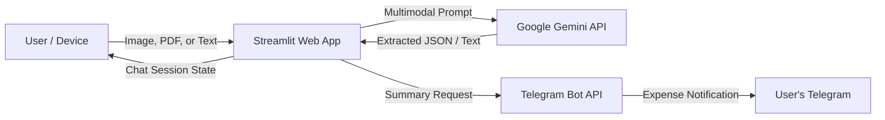

# 🧾 Receipt and Expense Tracker

An AI-powered smart receipt and expense tracking application built with **Streamlit** and **Google Gemini (`gemini-3.5-flash`)**. Upload receipt photos or documents, describe expenses in natural language, ask questions about your spending, and receive instant summaries delivered directly to your **Telegram**.

---

## 🌟 Features

- **📸 Multimodal Receipt Scanning**: Upload receipts in `.jpg`, `.jpeg`, `.png`, or `.pdf` formats or enter expense details via natural language text.
- **🤖 Intelligent Extraction & Categorization**: Leverages Google Gemini to automatically extract:
  - Merchant / Store Name
  - Purchase Date & Time
  - Itemized lists and individual prices
  - Subtotals, taxes, discounts, and final totals
  - Payment methods (Cash, Card, UPI, etc.)
  - Categorization (Food, Travel, Shopping, Healthcare, Bills, Education, Others)
- **💬 Conversational Expense Assistant (ReceiptSnap)**: Interactive chat session that tracks context, answers queries about spending totals, and breaks down category budgets.
- **📲 Direct Telegram Delivery**: Generates a clean, categorized expense summary and sends it straight to your Telegram account via the Telegram Bot API.
- **🔒 Safe Secrets Management**: Seamless integration with Streamlit's secrets manager (`.streamlit/secrets.toml`) and environment variables.

---

## 🏗️ Architecture & Data Flow



---

## 📁 Project Structure

```text
Receipt and expense tracker/
├── .streamlit/
│   └── secrets.toml          # API keys and bot tokens (do not commit)
├── app.py                    # Main Streamlit application and UI logic
├── prompts.py                # Gemini system instructions and prompt templates
├── requirements.txt          # Python project dependencies
├── .gitignore                # Git ignore rules for virtualenv and secrets
└── README.md                 # Project documentation
```

---

## 📋 Prerequisites

Before running the application, make sure you have:

1. **Python 3.10+** installed on your system.
2. **Google Gemini API Key**: Obtain one from [Google AI Studio](https://aistudio.google.com/).
3. **Telegram Bot Token**:
   - Open Telegram and search for [@BotFather](https://t.me/BotFather).
   - Send `/newbot` and follow the prompts to create your bot.
   - Copy the HTTP API token provided by BotFather.
4. **Telegram User Account**:
   - Make sure you start a conversation with your newly created bot (press **Start** or send `/start` to the bot) so it has permission to send you messages.

---

## 🚀 Quickstart & Setup

### 1. Clone or Open the Repository

```powershell
git clone https://github.com/kavi389025/Receipt-and-Expense-Tracker.git
cd "Receipt and expense tracker"
```

### 2. Create and Activate a Virtual Environment

**Windows (PowerShell):**
```powershell
python -m venv venv
.\venv\Scripts\Activate.ps1
```

**macOS / Linux:**
```bash
python3 -m venv venv
source venv/bin/activate
```

### 3. Install Dependencies

```powershell
pip install -r requirements.txt
```

> **Note:** If `requests` is not already installed in your environment, run:
> ```powershell
> pip install requests
> ```

### 4. Configure Secrets

Create a `.streamlit/secrets.toml` file in the project root:

```toml
GEMINI_API_KEY = "your-google-gemini-api-key"
TELEGRAM_BOT_TOKEN = "your-telegram-bot-token"
```

*Alternatively, you can export them as system environment variables with the same names.*

### 5. Launch the Streamlit App

```powershell
streamlit run app.py
```

The app will start and provide a local URL (typically `http://localhost:8501`). Open it in your web browser.

---

## 📖 How to Use

1. **Onboarding**:
   - Enter your name and your Telegram username (without the `@` symbol).
   - Click **Let's go 🚀** to start the session.
2. **Add Expenses**:
   - **Receipt Upload**: Click the attachment icon in the chat input to upload a receipt photo or PDF.
   - **Text Entry**: Type something like *"Spent $14.50 on lunch at Chipotle with Visa card"* or *"Uber ride for $22.00"*.
3. **Interact & Calculate**:
   - Ask follow-up questions such as *"How much did I spend on food so far?"* or *"What was the tax on my last receipt?"*.
4. **Send Summary to Telegram**:
   - Click the **📤 Send to Telegram** button in the header.
   - The app will compile all session expenses into a formatted summary and send it to your Telegram handle.

---

## ⚙️ Configuration Reference

| Variable | Description | Source |
| :--- | :--- | :--- |
| `GEMINI_API_KEY` | API Key for accessing Google Gemini models | `.streamlit/secrets.toml` or `env` |
| `TELEGRAM_BOT_TOKEN` | Bot API Token generated via `@BotFather` | `.streamlit/secrets.toml` or `env` |
| `MODEL_NAME` | Model configured in `app.py` (Default: `gemini-3.5-flash`) | `app.py` |

---

## 🔍 Troubleshooting

- **Telegram Delivery Error (`chat not found` / `bot was blocked by user`)**:
  - Ensure you have opened your bot on Telegram and clicked **/start**.
  - Ensure your Telegram username matches what you entered in the onboarding step (case-insensitive, no `@` prefix).
- **Gemini API Errors / Quotas**:
  - Verify your API key at [Google AI Studio](https://aistudio.google.com/).
  - Ensure your account has active quota for the `gemini-3.5-flash` model.
- **Session Reset**:
  - Streamlit stores data in session state for the active tab. Refreshing the browser will restart the onboarding and chat session.

---

## 🛡️ Security & Privacy

- Keep `.streamlit/secrets.toml` listed in `.gitignore` and never commit API keys or bot tokens to version control.
- Receipts and messages are processed through Google Gemini's API in accordance with your Google Cloud / AI Studio terms of service.
